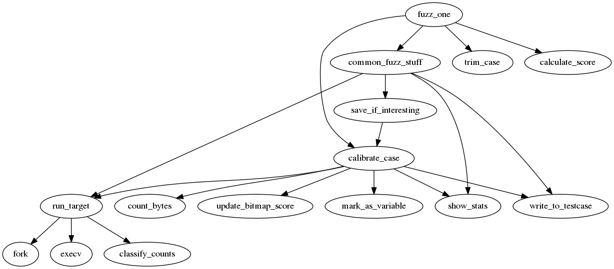

# American fuzzy lop

The flowchart of afl-fuzz

The core part is in `fuzz_one` function.

The call graph of `fuzz_one` is like this:

The logic of `fuzz_one`:
1. If there are favored cases pending and the current one case
   has been fuzzed or is not a favored case, then skip it; otherwise,
   even if there are no favored testcases, non-favored cases still can
   be skipped with some probability.
2. open the file saved in `queue_curr` and map its content to memory;
3. call `calibrate_case` to calibrate the input if previously calibrated in failure.
4. 

## bitmap

There is a hidden option `-B` for loading the bitmap.
When this is used, the contents of the specified file
will be read into `virgin_bits`.

`has_new_bits`: it will compare `trace_bits` with the argument
by comparing byte by byte, if there is a byte which has
value other than `0xff` in `trace_bits` while the value in
`argument` is `0xff`, then it means a new edge is found,
this function returns 2, else if there is(are) byte(s)
of different values, it will return 1.

After a new edge is detected, the corresponding byte is marked
by bit-anding the negation of the value `trace_bits`.

How does this work?

## scoring the input

`update_bitmap_score`:

For each byte in the bitmap, a pointer to the best rated testcase
is saved.

The metric for measuring the goodness of a testcase is "runtime * size"
meanting that, the faster the program finishes or, the smaller the testcase,
the better it is deemed to be.

The score of a test case is calculated in calibration stage.

`calibrate_case`:

Run the testcase multiple times, check whether it is variable or not
Then update the score of it by calling `update_bitmap_score`.

`calculate_score`:

This function is used to calculate the performance score.
Basically, it adjust the value according to the running time
of the testcase, the coverage and the depth.  The longer the running time,
the lower the score, the larger the coverage, the better the
perf score.

In fuzzing with some testcase, the perf score is calculated after
the calibration and trimming stage, and used in the havoc stage.
Basically the larger the perf score, the more havoc mutations will
be applied to the testcase.

## trimming input

The algorithm for trimming the testcase is in `write_with_gap`.

## pending_favored

How does this work?

## implementation details

1. When AFL found no new inputs, it will try using testcase splicing
   by setting `use_splicing` to 1 and and update the number of cycles
   without new inputs.

2. Each new testcase is first calibrated(to detect whether it is variable
   and update its score).

3. Each new testcase is trimmed. it works by removing some bytes in the
   testcase and then running it and check whether the checksum of the bitmap
   changes or not. If the checksum does does not change, the original testcase
   is replaced with the trimmed testcase.
