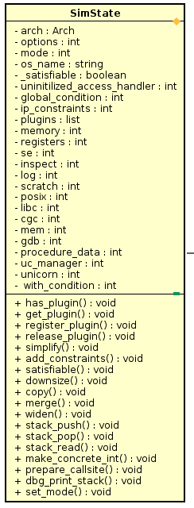

# Angr source study

## simvex

This is the package that is able to "execute" or simulate
program in the VEX format.

### concept

#### Mode

It is able to simulate program in symbolically and concretely.
This is called execution mode.

#### Program State

Program state is tracked using `SimState` class, including:
- register values
- memory values
- file system

Other important/interesting features of the program state is provided
via `Plugins`, including:

- regs: accessing registers
- mem: accessing memory
- se: constraint solver engine
- log:
- inspect: breakpoint mananger
- posix: some features defined in posix
- scratch: information about the current state
- libc: information of the c library
- cgc: information about the cgc environment
- unicorn: control of the unicorn engine
- uc_manager:

The class diagram is as follows:

#### Execution Engine

Execution engines are used to `execute`(interpret, simulate)
the code(vex code) that is accociated with the current state(
the `ip` of the current state can be retrieved from the `ip` field
of SimState object, more information can be get from the `Scratch`
state plugin object).

The API that does the execution is `process` defined in SimEngine.
It takes a SimState object(s1) as argument, returns the possible states
after executing the basic block asscociated with s1. The possible states
are wrapped in `SimSuccessors` class.

Current implementations are:

- SimEngineVEX: this engine interprets the VEX code one by one.
- SimEngineUnicorn: this engine execute the code with Unicorn.
- ...

Some implementationd details:
1. Some common code is written in the parent class `SimEngine.process`, the different
implementations are in `_process` method, which takes a new state and a SimSuccessors
as argument.
2. In SimEngineVEX, `_process` first lift the binary code basic block to VEX IR
Super block, and invoke `_handle_irsb` to handle the superblock. After doing some
setup for the successors object, it iterates through all the statements in the
superblock and invoke `_handle_statement` to handle each VEX statement.
`_handle_statement` will further call `translate_stmt` which will call the
`process` method of each class representing the simulated IR statement.

#### SimVexIR

This part is used to execute code represented in VEX IR and track
the constraints in symbolically execution.

Some implementation details:

1. SimIRStmt defines some common functions for its subclasses to reuse them:
   - \_translate\_expr
   - \_translate\_exprs
   - \_record\_expr
   - \_record\_exprs
   - \_add\_constraints
   - \_write_tmp

It exports `process` method to handle a VEX IR statement. The following is its
sequence diagram. `process` calls the `_execute` function of its subclasses which
takes an valina VEX IR expression and SimState as argument and construct a
corresponding SimIRExpr object(it is fully processed before being returned).

#### Plugins

Plugins are used to access information from a program state.
The system maintains all plugin implmentations in a `default_plugins`(defined
in plugins/plugin.py). All plugin implementation classes have a static method
that will register itself in `default_plugins`.

All plugins are subclasses of `SimStatePlugin`.

Each plugin provides unique APIs to get information
associated with the plugin.

A SimState object has a field for for handling different aspects
of a program.

| FieldName  | Plugin Class           | Desc                   |
|------------|------------------------|------------------------|
| memory     |SimSymbolicMemory       | Symbolic memory        |
| mem        |SimMemView              | |
| register   |SimSymbolicMemory       | |
| regs       |SimRegNameView          | |
| libc       |SimStateLibc            | |
| posix      |SimStateSystem          | |
| solver\_engine(se) | SimSolver       | |
| cgc        | SimStateCGC            | |
| scratch    | SimStateScratch        | |
| log        | SimStateLog            | |
| procedure\_data| SimProcedureData    | |
| gdb        | GDB                    | |
| inspector  | SimInspector           | |
| unicorn    | Unicorn                | |
|uc\_manager  | SimUCManager           | |
